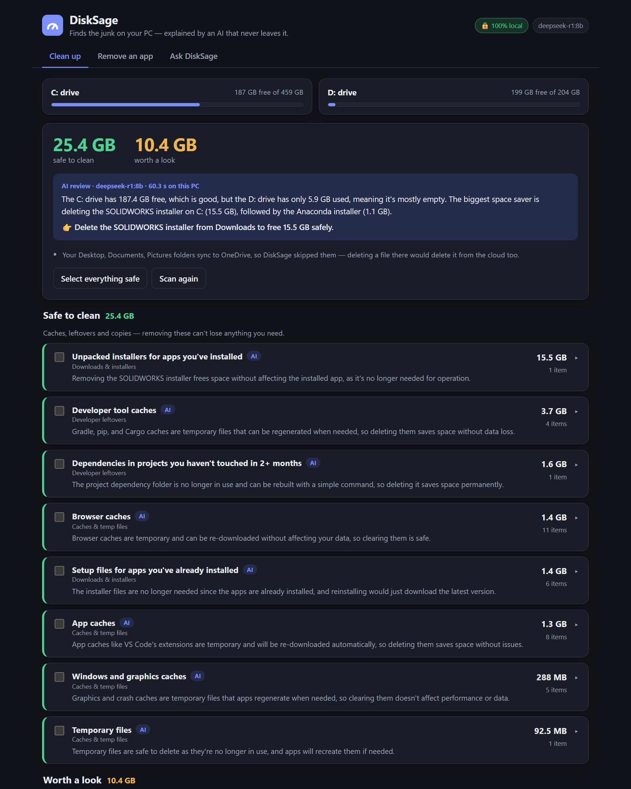

# DiskSage

**Finds the junk on your Windows PC, and explains it with an AI that never leaves your machine.**

My friends and I download everything (installers, zips, ISOs, datasets, whole SDKs) and delete almost nothing. Downloads is the junk you can see. The rest hides in temp folders, browser and app caches, `node_modules`, pip/Gradle/Cargo caches, driver installer leftovers and forgotten AI models.

DiskSage scans for all of it. A local, open-weight model (running in [Ollama](https://ollama.com)) then reviews every finding and explains, in plain English, what it is and whether it's safe to remove. Nothing is deleted until you tick it and confirm.

On my own laptop, the first scan took 5.5 seconds and found **25.4 GB that was safe to clean**. The biggest single item was a 15.5 GB unpacked SOLIDWORKS installer sitting in Downloads.



## What it finds

| Where | Examples |
|---|---|
| **Downloads** | Setup files for apps you've **already installed** (it reads your installed-apps list and matches them, versions included), unpacked installer folders, zips you've already extracted, half-finished downloads, ISOs, files untouched for 6+ months |
| **Duplicates** | Exact byte-for-byte copies (`report (1).pdf`). It always keeps one copy and never treats program files inside software folders as duplicates. |
| **Caches & temp** | Temp files older than a day; Chrome/Edge/Brave/Firefox caches; Electron app caches (Discord, VS Code, Slack, Teams…); NVIDIA/AMD/DirectX shader caches; crash dumps |
| **Developer leftovers** | pip, npm, Yarn, Gradle, NuGet, Cargo, Go caches; `node_modules`, `.venv` and Rust `target` folders in projects you haven't touched in 2+ months |
| **AI models** | Ollama models you're not using (never the one DiskSage runs on), Hugging Face and LM Studio downloads |
| **Windows & drivers** | `C:\NVIDIA` and `C:\AMD` installer leftovers, Windows Update leftovers (it hands those to Windows' own Disk Cleanup) |
| **Mystery folders** | Big AppData folders that **no installed app matches**, often left behind by apps you removed long ago. No rule can say what `AppData\Local\Pub` is, so the local model identifies each one from its name, its age and the names of a few things inside it (here: the Dart/Flutter package cache). |
| **Leave alone** | WSL/Docker virtual disks, Outlook mailboxes, `hiberfil.sys`, `pagefile.sys`: big, but it explains why you shouldn't delete them |

There are two more tabs:

- **Remove an app**: runs the app's own uninstaller, then finds the settings, cache and data folders it leaves behind (`AppData\Roaming\…`, `~\.vscode`, …). The AI says what each folder holds and warns about shared dependencies (Visual C++ runtimes, .NET, Java) that other apps still need.
- **Ask DiskSage**: free-form questions ("is it safe to delete WinSxS?"), answered using what the scan found on *your* PC.

## Why a local, open model and not a cloud API

- **The scan is a list of your file names.** Résumés, client projects, bank statements and folders named after people: to give advice, the model has to read that list. With a cloud API, that list goes to someone else's server. Here it goes to `127.0.0.1`. Your AppData is effectively a list of every app you've ever used, and DiskSage reads inside it to identify mystery folders.
- **It's free to run as often as you like.** A scan summary is thousands of tokens, so a paid API would charge for every rescan. Locally it costs nothing, so you can check every week.
- **It works offline.** Nothing needs the internet once the model is pulled.
- **The model is swappable.** It's one environment variable (`DISKSAGE_MODEL`). Try any model Ollama has.
- **The trade-off, honestly:** an 8B model knows less than a frontier model and sometimes guesses wrong. So DiskSage never lets the model decide alone. The scanner's own rules come first, and **the model can only make a verdict more cautious, never less.** Exact facts (installed versions, sizes, vendor folder names) are measured and handed to it, so it doesn't have to guess.

## Safety design

I don't trust an LLM with `rm`, so the model has no way to delete anything.

- The scanner **only reads**. `cleaner/actions.py` is the only code that removes anything, and it re-checks every path right before acting.
- It **never touches** Windows, Program Files, ProgramData, OneDrive-synced folders, drive roots or your main folders themselves.
- Your own files go to the **Recycle Bin**. Only things that rebuild themselves (caches, `node_modules`, `.venv`) are deleted permanently, and the confirmation dialog says which is which.
- **It checks the Recycle Bin can actually take them.** Windows silently deletes for good anything bigger than the bin's size limit, and everything when the bin is switched off. DiskSage reads each drive's bin settings and refuses those items instead of quietly breaking its "restorable" promise.
- It **never follows junctions or symlinks**, so a link inside a cache can't lead it into your documents.
- Nothing is pre-selected. You pick and confirm.
- The local server listens on `127.0.0.1` only, and every API call needs a per-run token embedded in the page. Other websites open in your browser can't send it commands.

Tested with 18 safety checks on a throwaway folder (including a junction trap pointing at "important" files and a switched-off Recycle Bin), on Python 3.10 and 3.13, and 22 browser UI checks.

## Run it

You need Windows 10/11, Python 3.10+, and [Ollama](https://ollama.com).

```bash
ollama pull deepseek-r1:8b
pip install -r requirements.txt
python app.py            # opens http://127.0.0.1:8765
```

Or just double-click **`DiskSage.bat`**. It checks for Python and Ollama, installs what's needed, and opens the page. Double-clicking it again just reopens DiskSage. Without Ollama, scanning and cleaning still work; you just don't get the AI explanations.

To use a different model: `set DISKSAGE_MODEL=qwen3:8b` before starting (any Ollama model that supports structured output).

## How it's built

```
app.py                 Flask server (localhost only, token-protected)
cleaner/detectors.py   everything it looks for — read-only
cleaner/installed.py   installed apps from the registry, installer matching, app leftovers
cleaner/llm.py         prompts + JSON schemas for Ollama (structured output)
cleaner/actions.py     the only code that removes anything, behind the safety checks
cleaner/paths.py       where things live + what is never touched
templates/, static/    the UI (no build step, no CDN, works offline)
```

## Limitations

- Windows only.
- Skips OneDrive-synced folders on purpose.
- Doesn't touch the registry, also on purpose.
- Microsoft Store apps aren't in the Remove-an-app list yet.

---

*Built for the [Hacktoberfest Weekend Challenge: Build for a Friend](https://dev.to/challenges/hacktoberfest-weekend-2026-10-01).*
